# Projeto demandas.

## O que é?

  - É um sistema feito para **armazenar e manipular demandas**.
  - É possível _cadastrar demandas_, _editar_, _remover_, _inputar horas_, _ver demandas em execução ou concluidas_, entre outras coisas.

  - Página principal   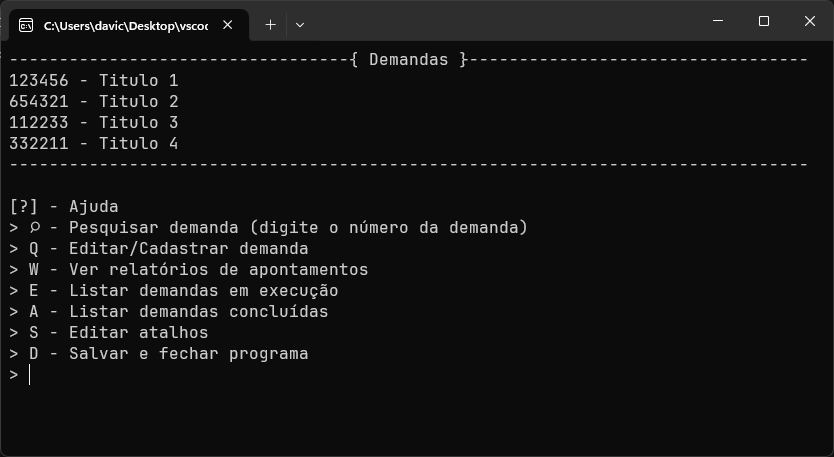
  - Dentro de 'Pesquisar demandas'  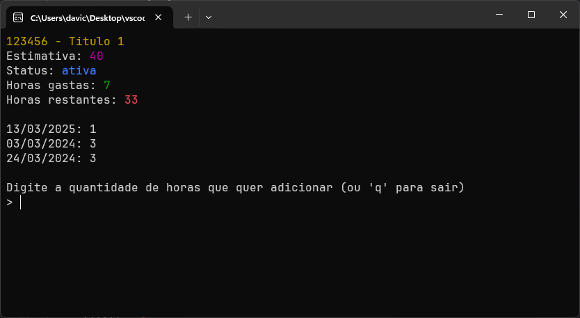
  - Dentro de 'Cadastrar/Editar demanda'  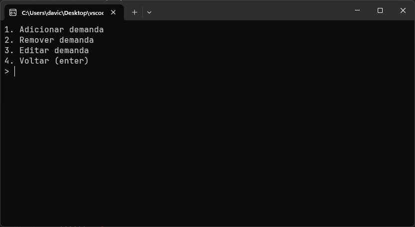

## Como funciona?

  1. **O usuário cadastra uma demanda.**
      - Contendo número da demanda;
      - Título da demanda;
      - Estimativa de horas.
  2. **Pode pesquisar essa demanda.**
      - É **exibida** essa demanda:
             
      - É possível **inputar as horas** para essa demanda;
          - *Define-se uma data.*
           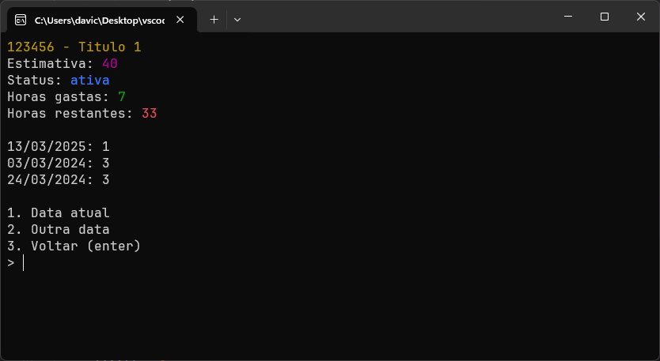
      
  3. **Pode editar uma demanda** 
      - No menu '*Cadastrar/Editar demandas*', na opção **3. Editar demanda**, você escolher essas opções:
          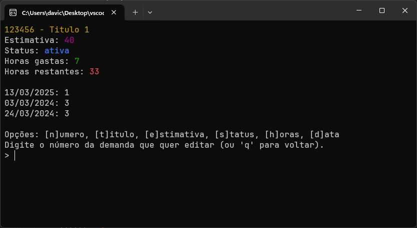
  4. **Pode visualizar o relatório de apontamentos.**
      - Há como pesquisar por *data específica*, *mês* ou *período*.
          - Data específica   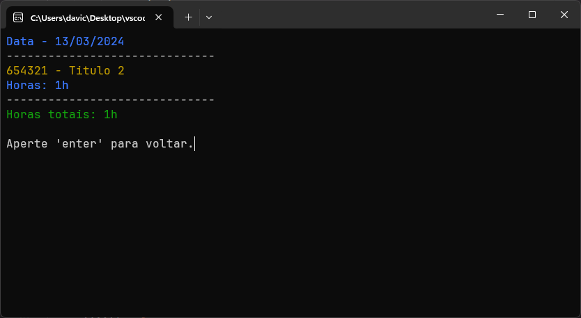
          - Mês específico   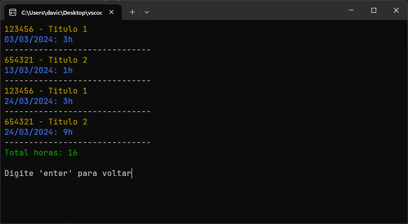
          - Período   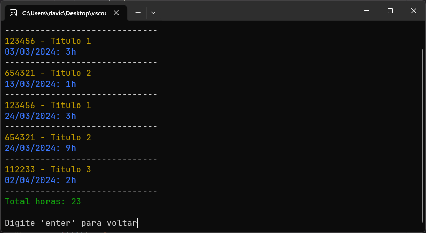
  5. **Pode listar as demandas em execução ou concluídas.**
        - Demandas em execução   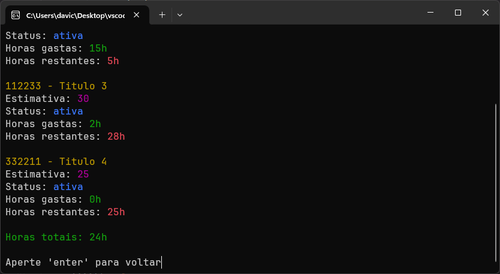
        - Demandas concluídas   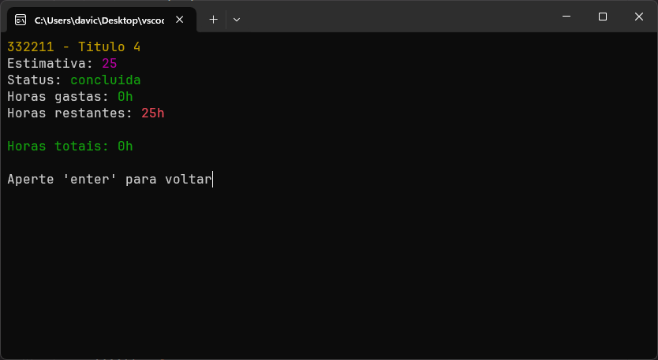
  6. **Pode configurar os atalhos que quiser.**
        - Aba de configuração de atalhos  
        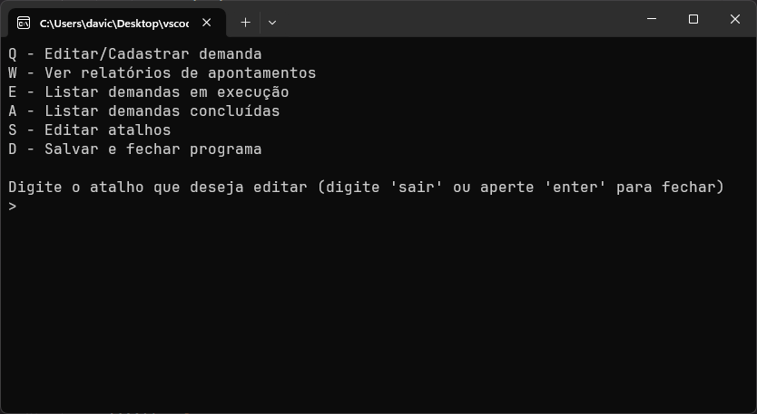
# Ajuda / Dicas

## Manejo do software.
  
  - Para pesquisar uma demanda basta digitar o número da demanda na página principal.
  - Para **selecionar** uma categoria, basta digitar alguma opção (*seja um número, ou uma confirmação como s/n*) e apertar enter.
  - Para **cancelar uma ação** ou **retroceder**, basta deixar um espaço em branco e apertar *'enter'* (*certifique-se de que não há nenhum caractere no terminal*).
  - Ao **inputar as horas**, o software verifica se há alguma hora inputada na data escolhida e **soma automaticamente**. Não é necessário se preocupar com isso.
  
## Dicas
  - As datas possuem diversos formatos aceitos, como dd/mm/yy ou dd-mm-yy ou ddmmyy. Você pode também apenas digitar o dia que o mes e o ano serão completados automaticamente com base na data atual.
  - Coloque o **dado apropriado** para determinada condição.
      - Ex: Ao cadastrar uma demandas, coloque um número na estimativa das horas.
  - Tente **não fechar o software** enquanto ele processa alguma informação, apesar de ser bem seguro, é bom ter cuidado.
  - **Evite editar o _json_** para não comprometer o funcionamente do software
  - Caso o _json_ seja **apagado** ou não existir o arquivo, _o software cria um novo arquivo automaticamente_, não precisa criar manualmente :)
